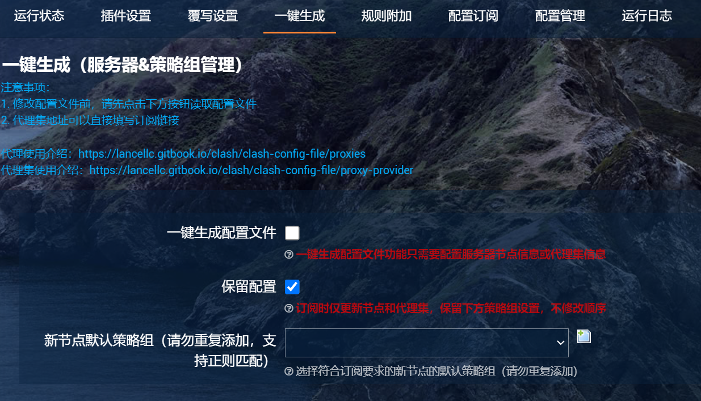
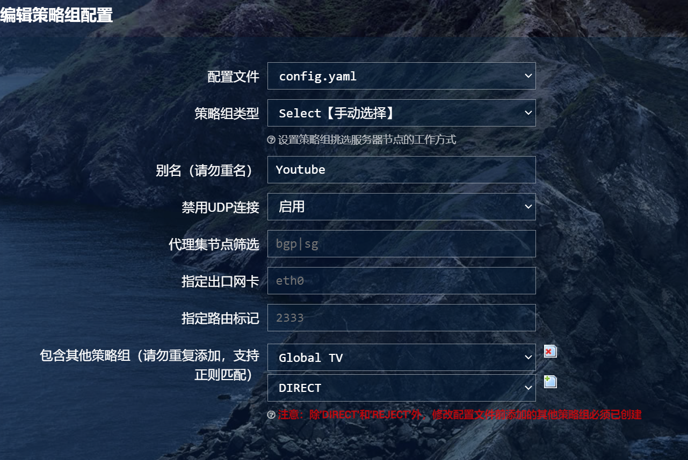

# Preparations

* Ensure that your OpenClash plugin is correctly installed and that the configuration file can be started without issues.
* **Make sure you have not enabled the one-click generated function (as shown in the image below)**

# Specific Steps

1. Create a policy group with the name of the application for which you want to utilize the streaming media enhancement feature. **Ensure that the policy group type is set to Select**, and choose other policy groups to include based on your specific requirements.

2. Open the Plugin Settings - Streaming Media Enhancement and select the option for automatically selecting unlocking nodes.  
If you are using Netflix or Disney Plus, it is recommended to select: **Experimental: Pre-resolve Netflix, Disney Plus domains**.  
It is also recommended to select **Close old connections**, and it is not recommended to select **Expand policy groups**.
3. Check the applications for which you want to utilize the streaming media enhancement feature in the list below.  
Fill in the name of the policy group you created in the first step in the Policy Group Filter field.  
For the **Unlocking Region**, fill in according to your needs, and you may leave the **Unlocking Nodes** filter blank.
4. Save and apply the configuration, and check the logs for any relevant output.
